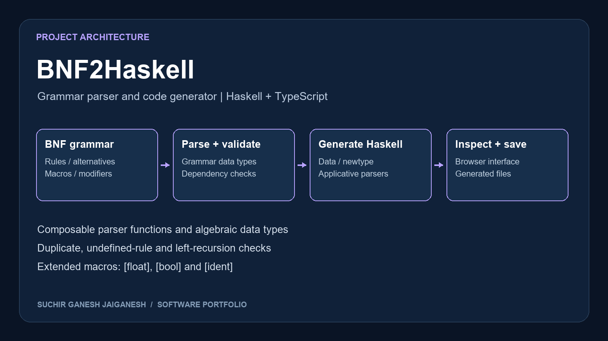

# BNF2Haskell

A BNF grammar parser and Haskell code generator developed for FIT2102 Programming Paradigms, with a TypeScript/RxJS browser interface.

## My implementation

- Algebraic data types representing grammars, rules, alternatives and grammar particles
- Composable parsers for terminals, non-terminals, groups, parameters and repetition modifiers
- Validation for duplicate definitions, undefined non-terminals and left recursion
- Generation of data/newtype declarations and applicative parser expressions
- Extended macros for `[float]`, `[bool]` and `[ident]`
- Saving generated Haskell with timestamps

The main implementation is split across `Typeshask`, `Grammarhask`, `Validatehask`, `Genratehask` and `Savehask`. The original module spellings are preserved.

## Run

Install Haskell Stack and Node.js. In `Haskell/`:

```sh
stack test
stack run
```

In a second terminal, in `JS/`:

```sh
npm ci
npm run dev
```

Enter BNF grammar in the browser interface to inspect generated Haskell. The backend compiles generated code locally; use it only as a local coursework demonstration.

## Attribution and verification

This project builds on the supplied Monash course scaffold, including parser infrastructure, web integration and test utilities. Existing author credits and source AI-use declarations are preserved; the complete scaffold is not claimed as original work. See `COURSE-SCAFFOLD.md` for the original run instructions.

Example grammars and expected outputs are included. The Haskell compiler and tests have not been run in this portfolio environment. The submission report and student identifier are excluded from this public package.

## Project visual


